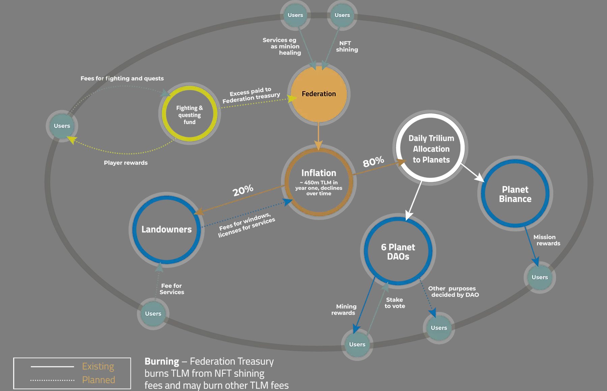

# Technical Overview

## Game platform overview
----------------------

The Alien Worlds gaming platform is evolving with functionality. A core technical principle is to build re-usable pieces or core components in the metaverse that can be leveraged by the community to use, and build upon to increase utility for TLM and NFTs and enable communities to create their own value in the Alien Worlds Metaverse.

The initial functionality is focused on a means of distributing TLM and NFTs throughout the community through inflation and game mechanics in mining and as rewards through other novel competitions, led by both the Federation and the community. The long term goal of this distribution is to empower many individuals and smaller groups in the community to grow the metaverse and ultimately decentralise the control away from any single or large controlling entity. To achieve this successfully will be a gradual process to avoid unexpected collections of wealth and control to develop while also ensuring no major technical problems are introduced which could be difficult to fix later in a decentralised system. This diagram gives a high-level overview of the current and future tokenomics of the project.

The metaverse consists of a federation of planets. Each planet will be governed as a DAO (Decentralised Autonomous Organisation), where players of the game could participate in elections to appoint a board of councillors to govern each planet. The full DAO functionality has not yet been built as further research is being conducted to find the most effective DAO governing strategy.

In this initial phase, TLM is continuously minted based on an inflation schedule from the Federation smart contract. It is then distributed to each planet weighted by the amount of TLM staked to each planet. From there, players of the game participate in a mining activity where they perform a client-side Proof-of-Work style exercise for they are rewarding and amount of the available TLM. The amount of TLM they could earn for a mining action is varied based on the attributes of the NFTs they have used to mine with, the land on a selected planet they have chosen to mine on and the available TLM in the mining reward bucket they are mining on.

Each Land object that users choose to mine on is also NFTs which earn a mining commission from each mine action and a share of the daily inflation rewards from the Federation. Since each planet is also accumulating rewards related to mining and inflation each day they are also accumulating a lot of wealth which (when the DAO functionality is active) will be available to the DAO governance to be used to build other game modules or whatever the DAO would like to use the funds for. With the interplay of creating NFTs with different powers and eventual autonomy for each planet, there will be opportunities for DAOs, groups and individuals to maximise their wealth in the metaverse.

## Technical Overview
------------------
The architecture of the Alien Worlds Platform utilises blockchain functionality as a core component to facilitate decentralisation and security of value away from a single centralised entity but that does not mean all functionality can or should be run directly on a blockchain. Instead, strategic choices are made on a case-by-case basis as to where functionality should be run. As guiding principles;

*   Blockchain smart contracts should be used for:
    *   End-user authorisation
    *   Financial or tokenomics calculations
    *   An immutable record of actions
    *   programmable decision processes with direct economic impacts
*   Off-chain scripts/services should be used for:
    *   Period actions that should run at a set time of frequency
    *   Handling Personal Identifiable Information (PIP)
    *   Processing of blockchain data to manipulate into a different format
    *   Processing large volumes of low-value data for aggregate results
    *   Cache processing
    *   End-user query endpoints

We are still very early in the blockchain space and there are not many successful examples to use as a leading light for the right architecture. Therefore there will be movements between on-chain vs off-chain for certain functionalities and we should not continue down the wrong direction as it becomes clearer we should pivot in another direction.

Aside from the high-level architecture, many of the current services, scripts and smart contracts have been written very quickly with the best intentions but with very limited developer resources from the early days of the project. This has left many areas with a significant level of tech debt that necessitates time and effort to improve. It also makes sense to not try to refactor or change too much of a technical system's functionality without first wrapping it with guard rails and good engineering practices to minimise the risk of breaking existing systems. After all, we are attempting to change the wings of a plane while we're in the air.

We currently have multiple services, scripts, smart contracts and even multiple blockchains that we engage with. In addition to improving and building on our current systems, we will continue to expand into selected new blockchain spaces into the future and will need to adapt to the challenges each one brings using the guiding principles from above as a starting point.

## The Future Roadmap
------------------
As our systems become more robust with automated tests, version control, CI/CD and better documentation we will begin to open up more of our services for public access to facilitate the community being able to build upon our technical foundation. If we build with scale and clean architecture in mind then the community of builders and contributors could choose to use our infrastructure and services directly, or (in support of decentralisation ideals) be able to run and maintain their own versions of our services building on a solid foundation of good engineering practices.

We are not constrained like many corporate entities that try to keep everything secret and closed source. We will and should always have some elements that need to be kept secret for security and other reasons but for the most part, we are building an open platform and the success of that platform is dependent on how successful we are at helping others succeed in using and building upon our platform. New technologies will always be considered based on a balance of the technical capabilities of the new proposed technology and the accessibility of developers to be able to operate and extend the services.

## Blockchains

Many of our current blockchain services are written for EOSIO blockchains (specifically WAX). This blockchain provides a very powerful execution and data management environment on-chain using the very accessible C++ language for smart contracts. We are, however, expanding to other blockchains with larger developer ecosystems by adopting Solidity for some functionality on different blockchains. Solidity based chains do not provide the same level of functionality that we can leverage on WAX (or other EOSIO chains). Therefore this will continue as an expansion of capabilities rather than a migration to Solidity based blockchains. We will continue to expand to other blockchains as the technologies evolve.

## Off-chain

For off-chain services, nearly all of them are written in Javascript/Typescript. This gives us thorough coverage, with access to many developers, functionality in many areas (APIs, scripts, data processing, Web UI etc) and fairly high performance. But we are not limiting ourselves to only using Typescript/Javascript. We also have a Golang API for one of our services which should be improved within GoLang rather than migrating to Typescript. A core principle is to choose a suitable technology for the job justified by reasons extending beyond the developer's comfort zone in one space (although that is one factor to consider).

## Standards

Standards around coding styles, documentation, interfaces between services and the system's architecture will lean towards patterns of least resistance to builders and maintainers. This is following the very effective software metric of measuring code/system quality by counting the number of WTFs per minute from someone trying to understand the system for the first time. Metrics such as code test coverage should be used to **help** developers improve code rather than constrain them from making progress or slowing them down.

As more developers join the team we will start to focus on more specific standards that developers will agree to follow (ie. specific language styles for linting). Initially, we will put in place some processes to facilitate CI/CD using Github Actions where possible, migrating services to Docker containers where possible (and sensible) and set up the basics for developer workflows with peer-reviewed pull requests. We will add tools to help enforce metadata around the PR processes such as [Danger](https://danger.systems/js/). The details of how PRs should look and what metadata should be included can be decided by the teams closest to that code. As much as possible we would like to give each technology team autonomy to manage the code as they see best, however, some strong common guidance will be likely to ensure at least some standards are common to all of the technology teams (eg. semantic versioning of all services). This will ensure we maintain compatibility between different areas (Backend APIs need to be version controlled and synchronous with the React front ends) and possibly comply with any future legal and security requirements as they are revealed.

# Smart Contracts

The Alien Worlds platform has a decentralised architecture facilitated by blockchain technology - specifically using the Wax blockchain, with smart contracts written in C++, and Ethereum and Binance Smart Chain (BSC) blockchains, with smart contracts written in Solidity. Using multiple blockchains allows for the platform to benefit from the superior throughput, performance and cheap blockchain actions available on WAX while, at the same time, being able to benefit from the additional industry exposure and trading liquidity available on Ethereum and BSC. While the critical application and value data is stored on underlying blockchains the users of the game will interact via web-based user interfaces that are designed to abstract the blockchain complexity away from the end-user.

While this requires users to trust the intermediate web layer written by the Alien Worlds team, the underlying blockchain data is available for anyone to audit since all transactions are recorded on public blockchain ledgers (WAX, BSC and Ethereum). The core features of the platform are separated into multiple smart contracts. This allows for each to be modified separately which has the benefit of reducing the risk of causing damage through software update bugs and also makes the evolution of features easier since there is a loose coupling between features. Loose coupling between software components in any software system is considered good practice for continual maintenance and evolution.

The EOSIO blockchain protocol (the underlying blockchain technology of WAX), has the added benefit of extremely powerful and secure permissions mechanisms built directly into the blockchain protocol. These mechanisms ensure that all the permissions to perform each of the smart contract actions, including updating the smart contract code and the permissions can be enforced with the utmost confidence at a protocol level.

Solidity based blockchains (Ethereum and BSC) have more industry acceptance based on user numbers and media exposure and therefore has gained more trust from this avenue. From a technical perspective, while smart contracts are not upgradable on Ethereum and BSC which poses a higher risk for being able to patch bugs at a later time, the immutability provides deterministic guarantees that nothing can ever be changed in the future.

## Smart Contracts/Actor interactions

This diagram shows all the interactions between the contracts

