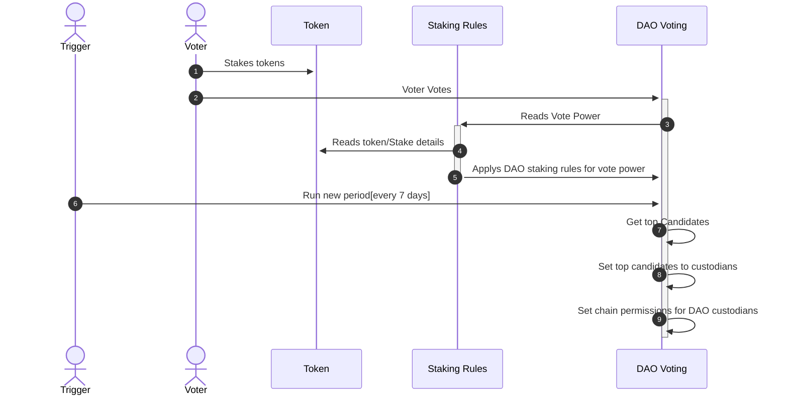

# Custodian Voting

import {BlockExplorerContractLinks, BlockExplorerActionLinks} from '@site/src/components/BlockExplorerLinks';

## <BlockExplorerContractLinks contract="dao.worlds"/>

This contract manages all the nomination, voting and tallying of votes, and the appointment of custodians at the conclusion of each election period. The ultimate outcome from this contract’s actions is management of permissions on the relevent DAO msig account. These allowed actions will be driven by various multi-sig transactions leveraging the the built-in sophisticated permission management tools available in the Antelope blockchain protocol. The parameters for the operations of the election process can be changed via a configuration object set on the contract via the `updateconfig` action.

### Voting and elections flow

## Actions:
---

### Candidate nomination <BlockExplorerActionLinks contract="dao.worlds" action="nominatecane"/>

To become an elected custodian for the DAO, a valid member must first nominate as a candidate using the `nominatecane` action. This requires the account name of the account nominating and a request pay amount of tokens (configurable via the config). This action checks that the user is a valid member and has staked sufficient tokens before succeeding. It also checks that the requested pay amount does not exceed the `requested_pay_max` from the config, and if all these conditions are met, it adds the user as a votable candidate for future voting actions.

### Voting <BlockExplorerActionLinks contract="dao.worlds" action="votecust"/>

The voting is performed by the `votecust` action and requires voter account and a list of candidates that the voter would like to vote for. The votes follow the following rules:

* Voting requires valid membership and agreement to the current member terms.
* The weight of each vote is determined by the balance of staked weight of DAO tokens the voter has in their account.
* Once a vote has been placed, that vote remains active until the voter changes the vote. This means that if the account balance falls to 0 and then has a balance added or one of the candidates resigns and then later returns the vote will still be active and applicable in the vote tallying.
* All candidates voted for by a voter receive the same vote weight based on the Staked Weight of DAO tokens.
* There is a maximum number of candidates a voter can vote for, determined by a config setting.
* To remove a vote, a voter would need to vote with an empty list of candidates.
* Voting and changing staked DAO token details for a voting account will have a direct and immediate effect on the weight of each active vote but the only time the weight of votes matters is the block when the `newperiod` action is called (explained below).

### New election periods <BlockExplorerActionLinks contract="dao.worlds" action="newperiod"/>

For each valid candidate, the vote weight will be continuously tracked based on changes triggered from the `votecust` action or from changes to the staked tokens in combination with the time since the `votecust` action was last called because votes decay over time. With these values being continuously tracked, the actual election (at the time of `newperiod` running) only needs to take a snapshot of the candidates ordered by ranking derived from a combination of total vote weight most recent average time stamp (more details below). The number of candidates is configurable via the `numelected` field on the config. There are other checks required to be satisfied in order to successfully run the `newperiod` action including:

* Ensure the initial number of voters exceeds the `initial_vote_quorum_percent` config.
* Ensure on subsequent elections the number of voters exceeds `vote_quorum_percent` config.
* Ensure the time period between calls to `newperiod` exceeds the `periodlength` time delay.

If all these checks succeed the following events are performed:

* Custodian pay is distributed as per the median amount of the current custodians' `requestedpay` amounts.
* The new custodians are allocated based the ranking weight of their accumulated votes for the next period.
* The permissions for operating the DAO accounts are updated to include the newly appointed custodians.
* The current time is saved to use as a time reference for future calls the `newperiod` to ensure it’s not called too early for the next period.

### Withdraw candidate <BlockExplorerActionLinks contract="dao.worlds" action="withdrawcane"/>
This would be called by an existing candidate, including one that is currently an elected custodian when they would like to remove themselves from the next period of elections. A good use case for this action may be a custodian going on holidays with the intention of returning soon. Otherwise, this action could be used for any other reason for a candidate voluntarily withdrawing from participating in the DAO operations.

### fire a candidate <BlockExplorerActionLinks contract="dao.worlds" action="firecand"/>
:::caution
This feature is currently disabled since it's a potential vulnerability for DAO governance.
:::
This would be called by the currently elected custodians via the multi-sig auth account to remove a misbehaving candidate. 

### fire a custodian <BlockExplorerActionLinks contract="dao.worlds" action="firecust"/>
:::caution
This feature is currently disabled since it's a potential vulnerability for DAO governance.
:::
 Similar to the `firecand` this action will remove a currently elected custodian as actioned by the other custodians. This will remove the custodian from elected custodian group, remove them as a potential candidate for future elections and finally update the account permissions to reflect the new, reduced set of elected custodians.

### resign a custodian <BlockExplorerActionLinks contract="dao.worlds" action="resigncust"/>
This action must be run by an active custodian who would like to resign from being an active custodian. This would remove them from an eligible candidate and remove them from being an active custodian or a pending custodian.

### Update requested pay <BlockExplorerActionLinks contract="dao.worlds" action="updatereqpay"/>
A candidate may update their requested pay as a custodian. This will not take effect until the next period to prevent mid-period changes to custodian pay. The amount must be less than the max allowed as set by the DAO config for `requested_pay_max`.

### Claim pay <BlockExplorerActionLinks contract="dao.worlds" action="claimpay"/>
This is the action called by an active custodian in order to receive the payment amount that is due to be paid to them. This can be either paid directly from the DAO's treasury account to the custodian, or it can be paid by a nominated service entity to handle parts of the process not covered by the blockchain actions.

### Configuration

There are several configurable options on the DAO voting contract to allow it to be customised
without recompiling and redeploying the code, so different DAOs can operate using the same
deployed code with their own configuration.

Configuration used to be set as one object through a single `updateconfig` action. **That action
is no longer deployed** - it has been replaced by individual actions, each setting one option, so
changing one value no longer requires restating the whole config.

| Action | Sets |
| --- | --- |
| <BlockExplorerActionLinks contract="dao.worlds" action="setlockasset"/> | `lockupasset` - DAO tokens each candidate must lock up to stand for election |
| <BlockExplorerActionLinks contract="dao.worlds" action="setdaogov"/> | `maxvotes`, `numelected` and the auth thresholds together. `numelected` must be 21 or fewer, `maxvotes` must be less than half of `numelected`, and the auth threshold must be below `numelected` - otherwise it could never be satisfied |
| <BlockExplorerActionLinks contract="dao.worlds" action="setperiodlen"/> | `periodlength` in seconds, which prevents early elections via `newperiod`. Default 7 days |
| <BlockExplorerActionLinks contract="dao.worlds" action="setpayvia"/> | `should_pay_via_service_provider` - route all payments via the service provider rather than paying directly |
| <BlockExplorerActionLinks contract="dao.worlds" action="setinitvote"/> | `initial_vote_quorum_percent` - token value in votes required to trigger the initial set of custodians |
| <BlockExplorerActionLinks contract="dao.worlds" action="setvotequor"/> | `vote_quorum_percent` - quorum required for each subsequent election period |
| <BlockExplorerActionLinks contract="dao.worlds" action="settokensup"/> | `token_supply_theshold` |
| <BlockExplorerActionLinks contract="dao.worlds" action="setlockdelay"/> | `lockup_release_time_delay` |
| <BlockExplorerActionLinks contract="dao.worlds" action="setpaymax"/> | `requested_pay_max` - ceiling on the pay a candidate may request |
| <BlockExplorerActionLinks contract="dao.worlds" action="setpenddelay"/> | `pending_period_delay` |
| <BlockExplorerActionLinks contract="dao.worlds" action="setrequirewl"/> | whether candidates must be whitelisted |
| <BlockExplorerActionLinks contract="dao.worlds" action="setbudget"/> | custodian budget as a percentage |
| <BlockExplorerActionLinks contract="dao.worlds" action="setspendbudg"/> | spendings budget as an amount |
| <BlockExplorerActionLinks contract="dao.worlds" action="setprpbudget"/> | proposals budget as a percentage |
| <BlockExplorerActionLinks contract="dao.worlds" action="setprpbudga"/> | proposals budget as an amount |

Each of these takes the `dac_id` as its last argument, so one deployed contract serves every DAO.
They are authorised either by the contract itself or by the DAC owner recorded in the
`index.worlds` directory.

