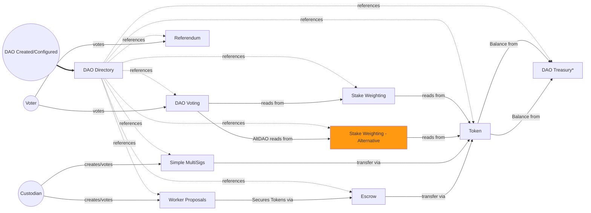

# DAO Index/DAO Directory

import {BlockExplorerContractLinks, BlockExplorerActionLinks, BlockExplorerTableLinks} from '@site/src/components/BlockExplorerLinks';

## <BlockExplorerContractLinks contract="index.worlds"/>

This contract is a single directory point for connecting modules for each DAO. A DAO is defined here with initial settings to enable the DAO. It then stores the locations of global smart contract configurations and enables the correct routing of inter-contract communication. This is a key component to enabling the modular architecture within the DAOs. 

Different different modules could be connected to create a DAO with extendable and customisable behaviour without needing to have endless customisable options within each smart contract. Eg. The Alien Worlds DAOs support stake weighted voting that combines the number of tokens with the time they are staked to calculate a weight which is used for vote counting. The Stake Weighted smart contract could be switched out for some DAOs if they would like to calculate the vote weight using a very different algorhythm without needing to modify or add options to the currently used Stake Weighted smart contract. 

Similar functionality modifications can be repeated across other functionality that it makes sense to modify. This modular approach makes it much easier and safer to deploy changes or extensions to the current DAO code because the functionality is sandboxed to specific code areas (like microservices) rather than one monolithic smart contract that contains all functionaility.

A common feature also included in the DAO Index is being able to utilise NFTs as feature toggles. Feature toggles are used frequently in large software systems to allow different cohorts of users to have a different user experiences. These are controlled via a central admin portal - usually owned an operated in the privacy of the creating company. By building this feature as a re-usable tool associated with NFTs, features can be enabled at various levels in a DAO by that DAO being in pocession of a particular NFT that unlocks a feature.

Over time an evolution of the DAO features this could grow to become a common place for more specific feature-agnostic triggers or controllers that could be utilised by other modules of the DAOs.

The diagram below attempts to demonstrate some of the connections. Everything related to a DAO can be referenced through the `Dac Directory` contract for each DAO, allowing for variable configurations between DAOs. 

Which contract/account is referenced is determined by a lookup in the DAO directory that holds unique references for each account/contract type for each DAO identifier.

For example, the DAO Voting below will use that `Stake Weighting` for one DAO but a different DAO may use `Stake Weighting - Alternative` instead because it has a different weighting algoryhthm in the smart contract. The alternative functionality could be built into the same `Stake Weighting` contract with if/else branching, but this will quickly become difficult to maintain and test, and it would be prone to code bugs. All of the accounts and contracts can be swapped out for different ones with the exception of the DAO directory, which acts a constant reference beacon that all other contracts can use a lookup reference source. 

This could be seen as analogous to DNS.

## Actions
---

### Register a DAO <BlockExplorerActionLinks contract="index.worlds" action="regdac"/>
This action used to register a new DAC/DAO with the index directory. Every DAO requires an owner account, a dac_id to uniquely identify it, a token symbol used to power the voting, a title, key/value sets of reference data and key/value sets of accounts used to set up the connections between all of the associated smart contracts. The `dac_id` must be greater than 4 characters long with no `.` in the name. The owner cannot own any other DAOs at the same time. Every account must have a treasury account, which is seen as the value centre for the DAO.
Other refs and account can either be added during the `regdac`, or they can be added later via oter actions.

### Register a reference item <BlockExplorerActionLinks contract="index.worlds" action="regref"/>
This action allows for adding/editing reference data to an existing DAO. Each data reference will have a uint8 as a key and the value can be any string. This could be used for holding URLs, social media data or general description data for the DAO.

### Unregister a reference item <BlockExplorerActionLinks contract="index.worlds" action="unregref"/>
This action allows for removing reference data from an existing DAO. It requires the key and the auth of the DAO to execute.

### Register an account item <BlockExplorerActionLinks contract="index.worlds" action="regaccount"/>
This action allows for adding/editing account data to an existing DAO. Each account a uint8 as a key and the value can be a valid account name. This could be used for configuring the DAO to use different smart contracts for different functionality eg. different staking or voting code logic or it can be used to identify key accounts for the DAO such as the treasury location.
:::caution
Changes here have the potential to break a DAO from being able to function.
:::

### Unregister an account item <BlockExplorerActionLinks contract="index.worlds" action="unregaccount"/>
This action allows for removing an account from an existing DAO. It requires the key and the auth of the DAO to execute.

### Set title <BlockExplorerActionLinks contract="index.worlds" action="settitle"/>
This action changes the human readable title of the DAO - not the `dac_id`. The dac_id cannot be changed.

### Set the owner <BlockExplorerActionLinks contract="index.worlds" action="setowner"/>
This action allow for setting the `owner` account of a DAO to a new accout. This has the potential to break an existing DAO, so this action requires the auth of both the current owner and the future owner to execute.

### Unregister a DAO <BlockExplorerActionLinks contract="index.worlds" action="unregdac"/>
This action removes the the DAO from the directory and it ceases to function. If there are assets that are locked in accounts managed by the DAO they may not be retrievable after this action has run. So this should be the last action called when shutting down a DAO after all it's assets have been moved.

### Configure Social media links <BlockExplorerActionLinks contract="index.worlds" action="setsociallnk"/>
This action adds a social media reference for the DAO (eg. Twitter, Telegram) to give the DAO and official "voice". The available social media links currently include:
* Twitter
* Telegram
* Web site
* Discord
* Instagram
* Facebook
* YouTube
* TikTok
* Medium

### Disable Social Media <BlockExplorerActionLinks contract="index.worlds" action="setsociallnk"/>
This action disables the social media sharing rather than removing all the links. This is intended as a simple switch to disable all the social links in one action without deleting them all. And will be switch automatically when there has been a significant governance change in the DAO (eg. more than 3 of the 5 custodians has changed in one election). This feature exists because it is assumed the custodian turnover represents a signifcant change in the "voice" of the DAO. The elected custodians can turn it back on with an MSIG proposal.

# Tables
---

### DACs/DAOs table <BlockExplorerTableLinks contract="index.worlds" table="dacs"/>
This holds all the global details for a DAO as it has been registered or modified.
The fields include:
* owner (name) - the owner account for the DAO
* dac_id (name) - unique identifer for the DAO
* title (string) - Human readbale name to identify the DAO
* symbol (extended symbol) - details about the token used to "power" this DAO
* refs - (key/value collection for strings) - mapping of general reference strings used in the DAO at a global scale keyed by uint8 values.
* accounts - (key/value collection for accounts) - mapping of accounts used throughout the DAO for the areas of feature logic in the smart contracts.

### DACs/DAOs table <BlockExplorerTableLinks contract="index.worlds" table="dacglobals"/>
This holds all the global details for a DAO from the social link perspective.
It is a key/value schemaless singleton with the key being one of the allowed social types. The key could be anything, but most likely a string for the social URL.

