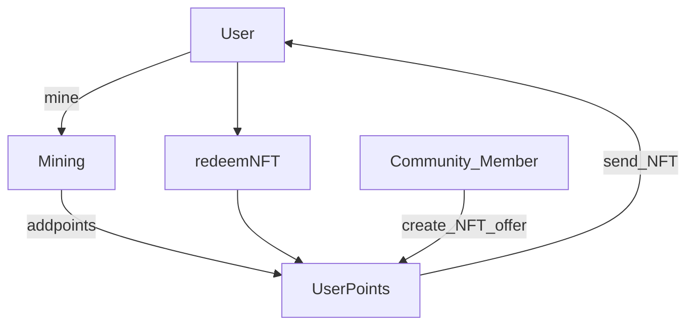

# User Points

import {BlockExplorerContractLinks, BlockExplorerActionLinks, BlockExplorerTableLinks} from '@site/src/components/BlockExplorerLinks';

## uspts.worlds <BlockExplorerContractLinks contract="uspts.worlds"/>

User points is a mechanism to reward players for specific actions in the metaverse. The rewards are non-transferable to encourage users to focus on one account rather than trying to earn points through many accounts. The user points accumulate in two primary forms. One is redeemable points which the user can choose to redeem for NFT offers and the other is level points which continue to increase as the user earns more points, earning them level NFT rewards (AKA Rank NFTs) without the user needing to redeem the points. In addition to these point tallies there tracking for the most daily and most weekly userpoints that get reset with the user's next action on the following day/week as applicable.

---
## Actions

### Earning Points - <BlockExplorerActionLinks contract="uspts.worlds" action="addpoints"/>
User points could be earned from any authorised actions but for not the only action that is permitted to add points for a user is mining. The number of points added per mine is determined by the NFT Power applied to each mine event for mines with NFT tools above the abundant rarity type. The points are added via an authorised inline acction from the mine action. In the future other Alien Worlds metaverse actions will also have the ability to add user points. Other game/dapps smart contracts may also be added to have the ability to add user points via [user points proxy](./userpoints-proxy.md)

## Distributing/Minting new Alien Worlds NFTs

### Set points reward for claiming - <BlockExplorerActionLinks contract="uspts.worlds" action="setptsreward"/>
NFT templates can be offered by the federation in exchange redeemable NFT user points. The offers would be set with action, specifying a `start` time , `end` time, the `template_id` and the `required` number of points to redeem for the NFT on offer. 

### Redeeming User Points for new NFTs - <BlockExplorerActionLinks contract="uspts.worlds" action="redeempntnft"/>
Redeemable user points can be redeemed by users for NFT offers as they see an offer for an NFT that is attractive for them to claim. If the template for the corresponding Atomic Assets template is full, this action will fail. It will also fail if it's before the `start` date or after the `end` date.

## Distributing existing NFTs

### Create and update offers for existing NFTs (available for anyone)
<BlockExplorerActionLinks contract="uspts.worlds" action="crtpreoffer"/>
<BlockExplorerActionLinks contract="uspts.worlds" action="updpreoffer"/>

Anyone can add NFT offers for pre-existing NFTs. This can be achieved by first calling this action to create a new offer.
Each offer can only be managed by the creator of the offer. Each offer must have a unique `offer_id`, and can only be created for one specific template in each collection. The required number of points required to redeem that NFT must be specified. The offer creator can then add a `message` and an optional `callback` to enable the offer creator to attach a user displayed meesage and smart contract logic to the offer redemption. The message is just a simple string eg. "redeem this NFT offer to be added to the newest community game". Then the `callback` parameter could point to a smart contract which will be called via an inline action during the redeem action which the creator could have set up to add arbitary logic eg. adding the redeeming user to a user table in their community created game.

Once the offer is created, NFT assets matching the offer collection and template_id can be added to the offer by transferring the assets to `uspts.worlds` with a specific memo to match the `offer_id`. eg. To add an asset to `offer_id` 123 the memo should contain only "123"
This will result in an offer's `available_count` being incremented and the `next_asset_id` being set to the lowest asset id matching the offer. 

### Redeem user points for pre-minted NFTs - <BlockExplorerActionLinks contract="uspts.worlds" action="redeemprenft"/>

This requires an offer_id  as is similar to current redeem action but the offers will be taken from the premint offers instead. Anyone redeeming a preminted NFT offer will always get the lowest mint NFT availble for that offer - assuming that lower mints are of greater value, the early redeemers should be rewarded. For each offer, the callback account could hold a smart contract that implements an action `logredeemnft` which could perform whatever smart contract logic they want at that point.
Upon successful redemption, the NFT will be transferred to the redeemer and the optional callback logic will be executed.
It's similar to the current process to redeem offers but the UI will need to call this action instead for the preminted offers:

---
## Tables

### Pre-mint Offers - <BlockExplorerTableLinks contract="uspts.worlds" table="premintoffrs"/>
The NFT offers available for pre-minted NFTs will be available at this table.
Each row in this table makes an offer available for all NFTs associated with that offer - loaded via transferring the NFT with the `offer_id` in the memo. Only NFTs matching the collection and template id for an offer will be accepted for a specific transfer.
The fields in this table include:
* `offer_id` - this is the offer unique ID that can group templates for assets all matching a particular offer configuration.
* `creator` - the name of the account who created and can manage this offer.
* `required` - the number of points required to redeem this type of NFT.
* `template_id` - the template id for the NFT to match this offer.
* `collection_name` - The atomic assets collection for where this collection belongs. This allows any community NFTs to be added.
* `message` - a configurable message associated with this offer. This provides a mechanism for the community to display a message to the potential redeemer about the NFT offer - eg. promotion of community event etc. 
* `callback` - This provides an ability for the offerer of the NFT to get an inline action sent to a smart contract of their design when a user chooses to redeem this offer. This could allow a community project to attach some logic to their NFT redemption such as minting another NFT, adding them to another game tournament etc. It's an optional field.
* `available_count` - Should track and display the number of assets available for this offer.
* `next_asset_id` - Gives a hint of the next NFT asset that would be redeemed from this offer if there is one available.

### Pre-mint assets - <BlockExplorerTableLinks contract="uspts.worlds" table="preassets"/>
The NFT assets available for pre-minted NFTs will be available at this table.
Each row in this table links an NFT asset held by this account to an associated Premint offer - loaded via transferring the NFT with the `offer_id` in the memo. Only NFTs matching the collection and template id for an offer will be accepted for a specific transfer.
The fields in this table include:
* `asset_id` - this is the asset ID for the NFT as identified through Atomic Assets.
* `offer_id` - the offer that this NFT is associated with.

### Userpoints - <BlockExplorerTableLinks contract="uspts.worlds" table="userpoints"/>
All the user points for all users are held in this table.
The fields in this table include:
* `user` - this is the asset ID for the NFT as identified through Atomic Assets.
* `total_points` - The complete number of points ever earned by this account. This is used for the levels since they never decrease with redeem actions.
* `redeemable_points` - The number of points earned by this account minus the points that have been redeemed for NFT rewards.
* `daily_points` - The number of points in the last day. This resets at UTC-0:00:00 each day. But it will not reflect in the table until their next point earning action.
* `weekly_points` - The number of points earned by this account minus the points that have been redeemed for NFT rewards.
* `daily_points` - The number of points in the last week. This resets at UTC-0:00:00 on a fixed 7 day cycle. But it will not reflect in the table until their next point earning action.
* `last_action_timestamp` - This tracks the user's last point earning action. It is mainly used as an internal reference to signal when the daily and weekly points are reset. eg. If a user's last action was yesterday reset the daily points otherwise increment the daily points.
* `milestones` - a future proofing field that allows for storing of custom key/value storage of milestones each user may achieve. This is not currently used for anything but will be used in future features.

### Level Offers - <BlockExplorerTableLinks contract="uspts.worlds" table="leveloffers"/>
The Level NFTs that can be redeemed by users when they achieve lifetime point levels are specified here. These would match the user's `total_points` value.
The fields in this table include:
* `id` - a unique id for the level offer
* `level` - number to indicate what level the user belongs to when acheived.
* `template_id` - the Atomic Assets template that will be minted for the user when they claim this level
* `required` - the number of points required to redeem this level

### Point Offers - <BlockExplorerTableLinks contract="uspts.worlds" table="pointoffers"/>
The Redeemable Point NFTs that can be redeemed by users when they achieve points are specified here. These would match the user's `redeemable_points` value.
The fields in this table include:
* `id` - a unique id for the level offer
* `start` - start date when the offer is active
* `end` - end date when the offer will become inactive and unable to be redeemed.
* `template_id` - the Atomic Assets template that will be minted for the user when they claim this offer.
* `required` - the number of points required to redeem this offer

