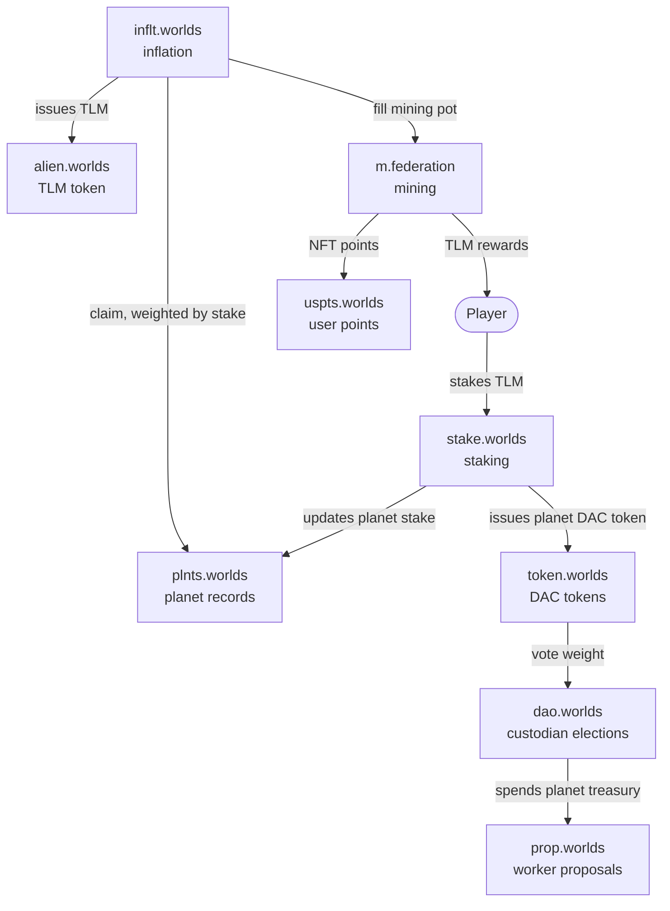
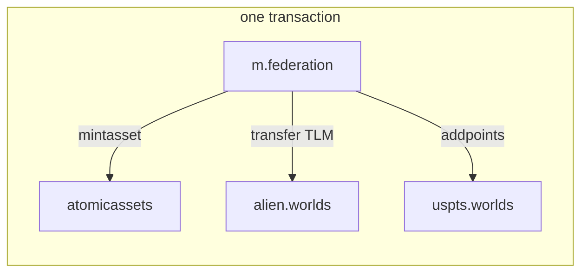

# The mental model

Start here. This page has no action names and no table names — it is the shape of the system, so
that the reference pages make sense when you reach them.

## What Alien Worlds is, mechanically

A **federation of planets**, each governed as its own DAO, sharing one token and one NFT
collection. Trilium (TLM) is minted on an inflation schedule and pushed outward: to planets in
proportion to how much TLM players have staked to them, and from planets to players through
mining. NFTs modify how much a player earns. Governance decides what each planet does with its
share.

Four things are worth holding in your head:

1. **One token, one NFT collection, many planets.** `alien.worlds` is the TLM token contract and
   also the NFT collection name. Planets are records, not separate chains.
2. **Staking is what makes a planet matter.** TLM staked to a planet determines its cut of
   inflation, and earns the staker that planet's own DAC token, which is the governance vote.
3. **Mining is the distribution mechanism**, not a side activity. It is how minted TLM reaches
   players, and how NFT attributes translate into earnings.
4. **Each planet is a DAO with real money.** Its inflation share accumulates, and its elected
   custodians decide how to spend it.



## The two mechanisms you must understand

Almost everything in this codebase is built from just two Antelope primitives. If you only learn
one thing before reading the contract reference, learn these.

### 1. Deposits arrive as transfer notifications

There is no `deposit` action anywhere. To put TLM into a contract, you **transfer** it to that
contract, and the contract reacts to the notification that Antelope delivers:

```cpp
[[eosio::on_notify("alien.worlds::transfer")]]
void ftransfer(const name &from, const name &to, const asset &quantity, const string &memo)
```

Six contracts listen for TLM transfers this way — mining, staking, land ratings, competitions,
land boost and tokelore. The `memo` field is how the sender says what the deposit is *for*, so a
memo format is effectively part of each contract's public interface.

This matters for two reasons. If you are building a UI, a deposit is a `transfer` with the right
memo, not a call to the contract you are depositing into. If you are extending a contract, this
is the hook you implement.

### 2. Contracts act on each other with inline actions

Contracts call each other directly in the same transaction. Mining does not ask a token contract
to pay a miner later; it sends the transfer inline, and if that fails the whole mine action
fails. This is why a mine action is atomic across several contracts.



### A consequence: the DAO layer resolves contracts at runtime

The game contracts hardcode the accounts they talk to. The DAO contracts deliberately do not.
Each DAC registers its own contract accounts in the `index.worlds` directory, and the governance
contracts look them up at runtime. That is what lets one deployed set of DAO contracts serve
every planet, and it is why some edges in the governance diagrams are labelled as resolved from
the directory rather than pointing at a fixed account.

## Where to go next

| If you want to understand | Read |
| --- | --- |
| Where TLM comes from and where it goes | [Token and inflation](./02-%20token-and-inflation.md) |
| How players earn | [Mining and rewards](./03-%20mining-and-rewards.md) |
| What a planet is and why staking matters | [Planets and staking](./04-%20planets-and-staking.md) |
| How a planet governs itself and spends | [DAO governance](./05-%20dao-governance.md) |
| Tools, lands, packs and shining | [NFTs and items](./06-%20nfts-and-items.md) |
| Bridging to other chains, competitions, lore | [Cross-chain and community](./07-%20cross-chain-and-community.md) |

Then the [Antelope smart contracts](../02-%20Antelope%20smart-contracts/README.md) section is the
per-contract reference: every action, every table, with field lists generated from the deployed
ABIs.
