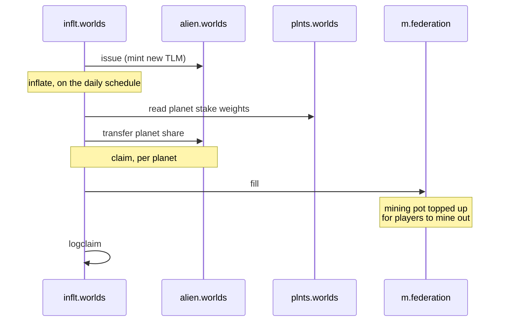

# Token and inflation

import {BlockExplorerContractLinks, BlockExplorerActionLinks, BlockExplorerTableLinks} from '@site/src/components/BlockExplorerLinks';

Where TLM comes from, and the path it takes to reach players and planet treasuries.

## The contracts involved

| Contract | Role |
| --- | --- |
| <BlockExplorerContractLinks contract="alien.worlds"/> | The TLM token itself. Also the name of the NFT collection. |
| <BlockExplorerContractLinks contract="inflt.worlds"/> | Mints new TLM on a schedule and distributes it. |
| <BlockExplorerContractLinks contract="token.worlds"/> | Per-planet DAC tokens, issued in exchange for staked TLM. |

## How new TLM enters circulation

Inflation is the only source of new TLM. The inflation contract mints it and then splits it two
ways: planets claim a share weighted by how much TLM is staked to them, and the mining pot is
topped up so players can mine it out.



The `logclaim` step does no on-chain work. It exists so that off-chain indexers have a clean,
structured record of each claim to read, rather than having to infer it from token transfers.

### Actions

#### <BlockExplorerActionLinks contract="inflt.worlds" action="inflate"/>
Mints new TLM according to the inflation schedule.

#### <BlockExplorerActionLinks contract="inflt.worlds" action="claim"/>
A planet claims its share, weighted by staked TLM and NFTs held.

#### <BlockExplorerActionLinks contract="inflt.worlds" action="logclaim"/>
Emits the claim as an inline action purely so it can be read off-chain.

#### <BlockExplorerActionLinks contract="inflt.worlds" action="pause"/> <BlockExplorerActionLinks contract="inflt.worlds" action="unpause"/>
Halt and resume inflation. The `pausable` table holds that state.

## The daily cap is a constant in the source

The inflation ceiling is compiled in, not configured on chain:

```cpp
// Inflation amount on 26th October 2025 was 829,029.5660 TLM
static constexpr int64_t DAILY_INFLATION_CAP_UNITS = 8'290'295'660;
```

Changing it requires recompiling and redeploying the contract. If you are reasoning about
long-term supply, this is the number to look at, and its comment records when it was last set.

## Two different tokens

This trips people up constantly, so it is worth stating plainly:

- **TLM** (`alien.worlds`) is the shared game token. One symbol across the whole federation.
- **Planet DAC tokens** (`token.worlds`) are separate, one per planet. You receive them by
  staking TLM to that planet, and they are what give you governance weight in that planet's DAO.

So staking TLM is simultaneously an economic act (it directs inflation to that planet) and a
political one (it buys you a vote there). The [staking page](./04-%20planets-and-staking.md)
covers the exchange, and [DAO governance](./05-%20dao-governance.md) covers the vote.

## Tables

#### <BlockExplorerTableLinks contract="inflt.worlds" table="state"/>
Global inflation state. This table used to live on the `federation` contract and moved here with
the claim actions.

#### <BlockExplorerTableLinks contract="inflt.worlds" table="payouts"/> <BlockExplorerTableLinks contract="inflt.worlds" table="dacpayouts"/>
Payout records, overall and per DAC.

#### <BlockExplorerTableLinks contract="inflt.worlds" table="reserve"/>
Amounts held back from distribution.
