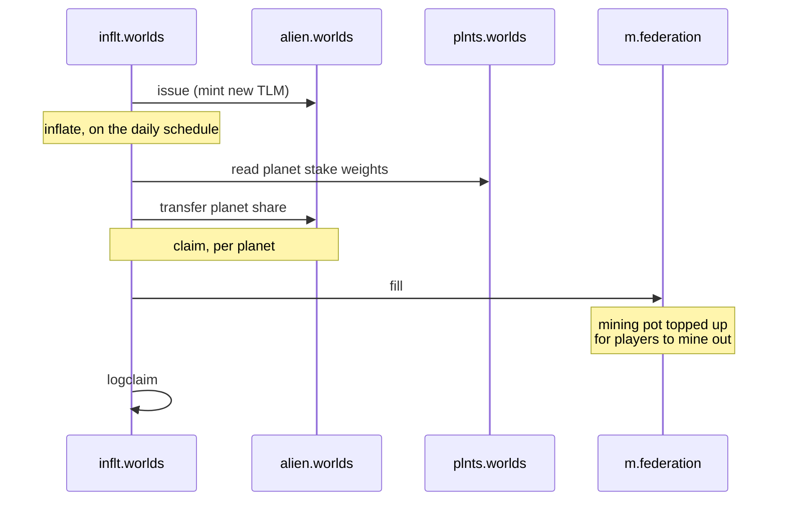

# Token and inflation

import {BlockExplorerContractLinks, BlockExplorerActionLinks, BlockExplorerTableLinks} from '@site/src/components/BlockExplorerLinks';

Where TLM comes from, and the path it takes to reach players and planet treasuries.

## The contracts involved

| Contract | Role |
| --- | --- |
| <BlockExplorerContractLinks contract="alien.worlds"/> | The TLM token itself. Also the name of the NFT collection. |
| <BlockExplorerContractLinks contract="inflt.worlds"/> | Mints new TLM on a schedule and distributes it. |
| <BlockExplorerContractLinks contract="token.worlds"/> | Per-planet DAC tokens, issued in exchange for staked TLM. |

## How new TLM enters circulation

Inflation is the only source of new TLM. The inflation contract mints it and then splits it two
ways: planets claim a share weighted by how much TLM is staked to them, and the mining pot is
topped up so players can mine it out.



The `logclaim` step does no on-chain work. It exists so that off-chain indexers have a clean,
structured record of each claim to read, rather than having to infer it from token transfers.

### Actions

#### <BlockExplorerActionLinks contract="inflt.worlds" action="inflate"/>
Mints new TLM according to the inflation schedule.

#### <BlockExplorerActionLinks contract="inflt.worlds" action="claim"/>
A planet claims its share, weighted by staked TLM and NFTs held.

#### <BlockExplorerActionLinks contract="inflt.worlds" action="logclaim"/>
Emits the claim as an inline action purely so it can be read off-chain.

#### <BlockExplorerActionLinks contract="inflt.worlds" action="pause"/> <BlockExplorerActionLinks contract="inflt.worlds" action="unpause"/>
Halt and resume inflation. The `pausable` table holds that state.

## Daily inflation decreases over time

The amount minted each day is **not fixed**. It is a fixed *percentage of the remaining reserve*,
and because each day's mint is deducted from that reserve, the daily amount falls continuously:

```cpp
const auto inflation_double =
    (reserve * (S{13.0} + (S{number_planets}.to<double>() * S{1.9}))) / S{100000.0};
...
// Reduce the reserve by the amount of inflation we're about to issue
res.total = S{res.total} - S{inflation_after_rounding.amount};
```

With the maximum of seven planets that rate is `(13 + 7 × 1.9) / 100000`, or about **0.0263% of
the reserve per day**. A smaller reserve tomorrow means a smaller mint tomorrow — the curve
decays and never resets, because nothing in the contract adds to the reserve during `inflate`.

The number of planets is the only other input, and it is capped at seven.

### The constant in `config.hpp` is a safety ceiling, not the daily amount

`config.hpp` carries a figure that is easy to misread as the inflation rate:

```cpp
// Inflation amount on 26th October 2025 was 829,029.5660 TLM
static constexpr int64_t DAILY_INFLATION_CAP_UNITS = 8'290'295'660;
```

:::caution This is a maximum, not the amount minted
This constant is never used to calculate anything. It is only ever used to **assert** that the
calculated inflation has not exceeded it, and the contract's own comments label both checks as
"Defense-in-depth":

```cpp
::check(S{inflation.amount} <= S{DAILY_INFLATION_CAP_UNITS}, "Inflation exceeds daily cap. ...");
```

The check runs twice — once on the calculated figure and again after rounding — and a breach
aborts the whole `inflate` action rather than clamping it to the cap. It exists so that a bug in
the calculation, or a bad reserve value, can never mint an unbounded amount.

The comment records what actual inflation was on the day the ceiling was set. Because real
inflation decays with the reserve, the true daily figure has been below this number ever since
and moves further below it every day.
:::

## Planet voting tokens are locked TLM

There is only one token of value in the system: **TLM**. When you stake TLM to a planet, that TLM
is locked, and you receive that planet's voting token in return.

Technically the planet token is a separate symbol on `token.worlds`, but it is best understood as
a **receipt for locked TLM that carries a vote**. It is not a second currency to trade or earn:

- It is issued only in exchange for TLM being locked, and burned when that TLM is released.
- Its only real use is voting weight in that planet's DAO.
- Its supply is therefore a direct measure of how much TLM is committed to that planet.

So staking is one act with two effects: your TLM is locked behind a planet — which is what
directs inflation to it — and while it is locked you hold a vote there. The
[staking page](./04-%20planets-and-staking.md) covers the mechanics and
[DAO governance](./05-%20dao-governance.md) covers the vote.

## Tables

#### <BlockExplorerTableLinks contract="inflt.worlds" table="state"/>
Global inflation state. This table used to live on the `federation` contract and moved here with
the claim actions.

#### <BlockExplorerTableLinks contract="inflt.worlds" table="payouts"/> <BlockExplorerTableLinks contract="inflt.worlds" table="dacpayouts"/>
Payout records, overall and per DAC.

#### <BlockExplorerTableLinks contract="inflt.worlds" table="reserve"/>
Amounts held back from distribution.
