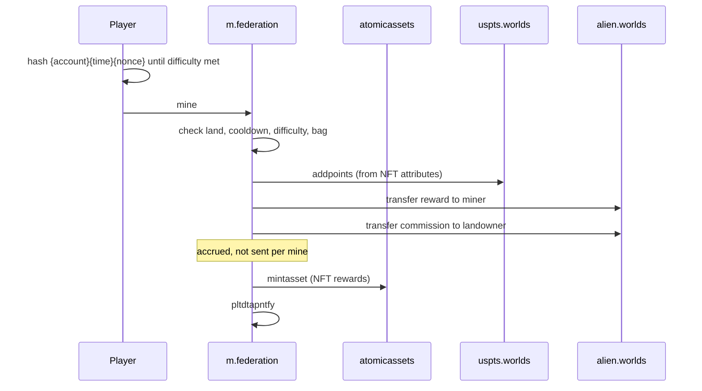
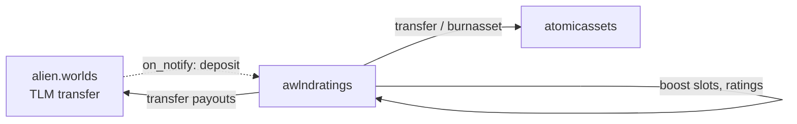

# Mining and rewards

import {BlockExplorerContractLinks, BlockExplorerActionLinks, BlockExplorerTableLinks} from '@site/src/components/BlockExplorerLinks';

Mining is how minted TLM reaches players. It is also the most cross-contract operation in the
system: a single `mine` action touches four contracts and must succeed in all of them or none.

## The contracts involved

| Contract | Role |
| --- | --- |
| <BlockExplorerContractLinks contract="m.federation"/> | The mining contract. Validates proof of work, pays rewards. |
| <BlockExplorerContractLinks contract="awlndratings"/> | Land ownership, land commission and profit share. |
| <BlockExplorerContractLinks contract="uspts.worlds"/> | User points, earned from NFT attributes, redeemable for NFTs. |
| <BlockExplorerContractLinks contract="atomicassets"/> | The third-party WAX NFT standard holding tools and land. |

## A mine action, end to end

The player does the work off-chain — hashing until the result satisfies the difficulty set by
their land and tools — then submits it. Everything after that happens in one transaction.

Because these are inline actions, a failure anywhere — insufficient pot, a cooldown not elapsed,
a bad proof — rolls the whole thing back. There is no partial mine.

## Why rewards are accrued rather than paid

Both miner rewards and landowner commissions accumulate in tables and are claimed later, by
<BlockExplorerActionLinks contract="m.federation" action="claimmines"/> and
<BlockExplorerActionLinks contract="m.federation" action="claimcomms"/>.

This is deliberate. Paying a landowner on every single mine action would spam the chain with
micro-transfers, one per mine, for every parcel. Accruing means the landowner pays one
transaction whenever they choose to collect. If you are building a UI, this is why a player's
balance and their "mined so far" figure are different numbers in different tables.

## What decides how much you earn

Mining output is not flat. It is the product of several factors, which is what creates room for
strategy:

- **Tool rarity** — each rarity draws from a different pool, and each planet can configure the
  percentage share per rarity independently.
- **Land attributes** — a parcel's ease, delay and difficulty modify the work required and the
  payout.
- **Bag cooldown** — the cooldown is taken from the most recent of the miner's previous mine or
  the last use of any tool in their bag, so tools cannot be cycled freely.
- **Pot fill rate** — the pot refills over time from inflation, so mining into an empty pot pays
  less.

The per-planet configuration lives in
<BlockExplorerTableLinks contract="m.federation" table="pools"/> and
<BlockExplorerTableLinks contract="m.federation" table="config"/>.

## Land, commission and profit share

Land is an NFT, so land ownership changes by NFT transfer, not by a contract action. The land
ratings contract tracks ownership and the commission each parcel takes from mines performed on
it.

Owners set their own terms with
<BlockExplorerActionLinks contract="awlndratings" action="setprofitshr"/> and
<BlockExplorerActionLinks contract="awlndratings" action="setlandnick"/>. Both actions were
originally on the `federation` contract and moved here.

## User points are a second currency

Mining earns TLM *and* user points, weighted by the attributes of the tools used. Points are
tracked in <BlockExplorerContractLinks contract="uspts.worlds"/> and redeemed for NFTs rather
than tokens — which is why mining with better tools matters even when the TLM pot is low.

Points are added by inline action from the mining contract, so a player's point balance is only
ever changed as part of a mine.

The proxy contract <BlockExplorerContractLinks contract="ptpxy.worlds"/> is a **budgeted
delegation layer** in front of the points contract. An *allocator* is registered with a total
budget; the allocator then grants a *points manager* a budget spread over a number of days, and
the contract clamps each grant so the allocator cannot exceed its own total. `setbudget` requires
the allocator's authority, so point-granting can be handed out to other systems without giving
them unbounded power to mint points.
