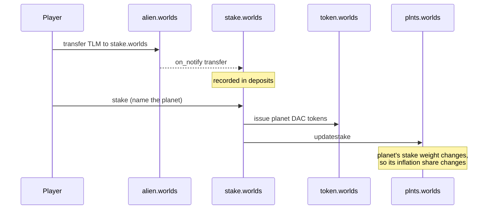

# Planets and staking

import {BlockExplorerContractLinks, BlockExplorerActionLinks, BlockExplorerTableLinks} from '@site/src/components/BlockExplorerLinks';

A planet is a record, a treasury and a DAO. Staking TLM to one is the act that makes it matter.

## The contracts involved

| Contract | Role |
| --- | --- |
| <BlockExplorerContractLinks contract="federation"/> | Users, avatars and terms acceptance. |
| <BlockExplorerContractLinks contract="plnts.worlds"/> | Planet records, map coordinates, stake totals. |
| <BlockExplorerContractLinks contract="stake.worlds"/> | Staking TLM and issuing planet DAC tokens. |
| <BlockExplorerContractLinks contract="token.worlds"/> | The planet DAC tokens themselves. |

:::note The Federation contract is much smaller than it used to be
The `federation` account now exposes only four actions. Planet management, staking and claims all
moved to the contracts above. Older material describes them as Federation actions — see the
[Federation reference page](../02-%20Antelope%20smart-contracts/02-%20alien%20worlds-smart-contracts/02-%20federation.md)
for the full mapping of what moved where.
:::

## Staking, step by step

Staking is a two-step interaction, because the deposit arrives as a token transfer:

Both steps can be sent in **one transaction**, which is the recommended approach: if the stake
fails, the transfer rolls back with it and the player is never left with an unallocated deposit.

Unstaking returns the DAC token and burns it:
<BlockExplorerActionLinks contract="stake.worlds" action="withdraw"/> takes back deposits that
have not yet been exchanged, and the staking contract calls `token.worlds::burn` when DAC tokens
are redeemed.

### Why staking has two effects at once

| Effect | Consequence |
| --- | --- |
| Economic | The planet's stake total rises, so it claims a larger share of daily inflation. |
| Political | You hold that planet's DAC token, which is your vote weight in its elections. |

This coupling is intentional: the people who direct value to a planet are the people who govern
it. It also means vote weight can be computed from token balances — see
[DAO governance](./05-%20dao-governance.md) for how that is observed, and for how a DAC can
override the calculation.

## Planet records

Planets are rows, created and maintained by administrative actions on the planets contract:
<BlockExplorerActionLinks contract="plnts.worlds" action="addplanet"/>,
<BlockExplorerActionLinks contract="plnts.worlds" action="updateplanet"/>,
<BlockExplorerActionLinks contract="plnts.worlds" action="removeplanet"/> and
<BlockExplorerActionLinks contract="plnts.worlds" action="setmap"/>.

The map is a coordinate-to-NFT mapping in
<BlockExplorerTableLinks contract="plnts.worlds" table="maps"/> — land parcels are NFTs placed at
map positions, which is what ties the [mining](./03-%20mining-and-rewards.md) geography to the
NFT collection.

## Users belong to the Federation

Player identity stays on the Federation contract:
<BlockExplorerActionLinks contract="federation" action="setavatar"/>,
<BlockExplorerActionLinks contract="federation" action="settag"/> and
<BlockExplorerActionLinks contract="federation" action="agreeterms"/>. Terms acceptance is
recorded per user with the version and hash of the terms they agreed to, in
<BlockExplorerTableLinks contract="federation" table="userterms"/>.
