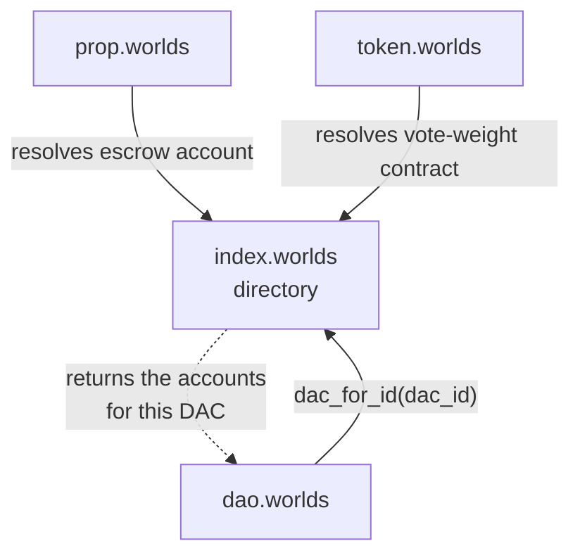
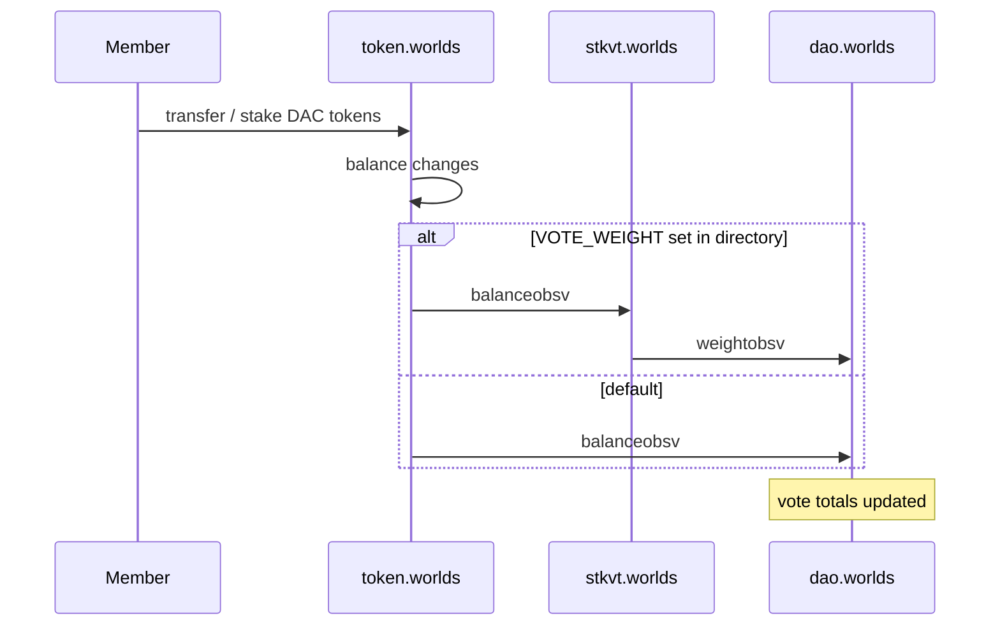
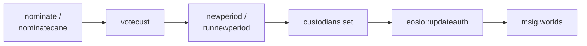
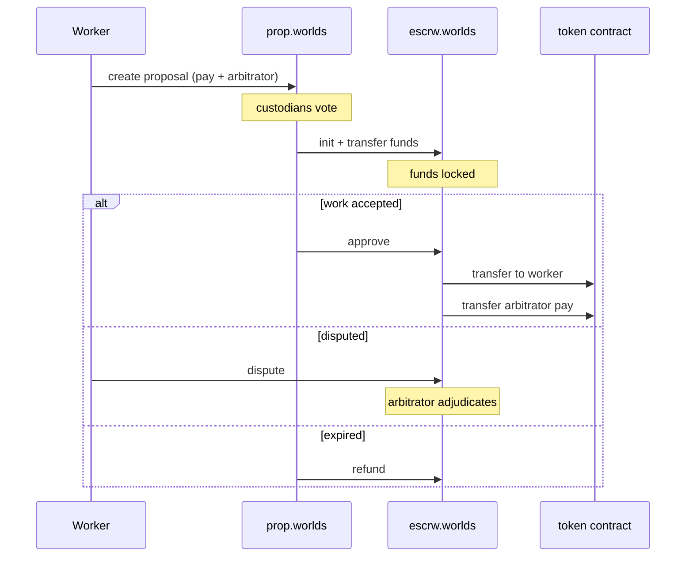

# DAO governance

import {BlockExplorerContractLinks, BlockExplorerActionLinks, BlockExplorerTableLinks} from '@site/src/components/BlockExplorerLinks';

Each planet is governed by elected custodians who control its treasury. The governance contracts
come from the eosDAC codebase and are deliberately generic: **one deployed set serves every
planet**.

## The contracts involved

| Contract | Role |
| --- | --- |
| <BlockExplorerContractLinks contract="index.worlds"/> | The DAC directory. Maps a `dac_id` to that DAC's contract accounts. |
| <BlockExplorerContractLinks contract="dao.worlds"/> | Custodian nomination, voting, elections, pay and budgets. |
| <BlockExplorerContractLinks contract="token.worlds"/> | DAC tokens; the default source of vote weight. |
| <BlockExplorerContractLinks contract="stkvt.worlds"/> | Optional stake-based vote weight, overriding the default. |
| <BlockExplorerContractLinks contract="prop.worlds"/> | Worker proposals: funding work from the treasury. |
| <BlockExplorerContractLinks contract="escrw.worlds"/> | Holds proposal funds until work is settled. |
| <BlockExplorerContractLinks contract="ref.worlds"/> | Referendums — member votes on non-proposal questions. |
| <BlockExplorerContractLinks contract="msig.worlds"/> | Multi-signature execution of custodian-authorised actions. |

## Every action carries a `dac_id`

This is the single most important structural fact about this layer. Actions take the DAC
identifier as an argument, tables are scoped by it, and contract accounts are looked up in the
directory at runtime:

The practical consequence: you cannot tell which contract a governance action will call just by
reading the source, because the target is a directory lookup. Several edges in the extracted call
graph are dynamic for exactly this reason. When extending this layer, the directory is the
integration point — you register your contract there rather than patching anyone's code.

## Vote weight is observed, not owned

The custodian contract does not read token balances directly. It is *notified* of weight changes:

By default liquid token balance is the weight. If a `VOTE_WEIGHT` entry is set in the directory,
the token contract sends `balanceobsv` there instead, and that contract computes whatever weight
it likes before sending `weightobsv` to the custodian contract. `stkvt.worlds` is the shipped
example, using staked balances and commitment time.

**This is the main extension seam in the whole system.** A custom voting scheme is a contract
that accepts `balanceobsv`, exposes a `weights` table, and sends `weightobsv` — no change to the
custodian contract required.

## Electing custodians

Candidates nominate themselves and lock up an asset to do so. Members vote. When a period ends,
`newperiod` counts votes and appoints the new custodian set — and then the contract calls
`eosio::updateauth` to rewrite the DAC's on-chain account permissions so that the new custodians
are the accounts that can authorise treasury actions. That call is why governance has real
custody: the election result becomes an Antelope permission.

Quorum rules gate this. `initial_vote_quorum_percent` must be met before the first custodian set
can be appointed, and `vote_quorum_percent` applies from the second period onwards.

## Funding work: proposals and escrow

The important subtlety: **only the proposals contract may settle an escrow.** `approve` requires
the escrow contract's own authority, so an arbitrator or sender cannot release funds directly.
The proposals contract treats the presence of the escrow row as the truth about whether work is
still live, and settling an escrow behind its back would leave the tracking proposal stranded.

## Referendums

<BlockExplorerContractLinks contract="ref.worlds"/> handles member votes on questions that are
not worker proposals. A passed referendum can propose a transaction into
<BlockExplorerContractLinks contract="msig.worlds"/> for custodian execution, which is how a
member vote turns into an on-chain action.
