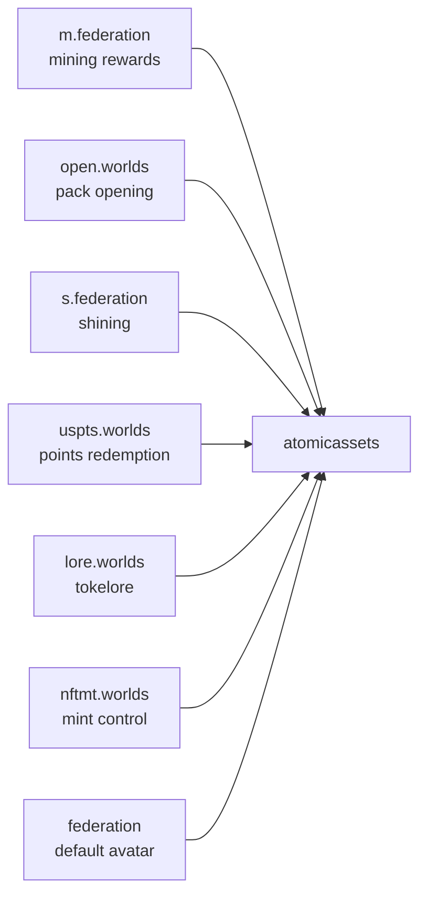
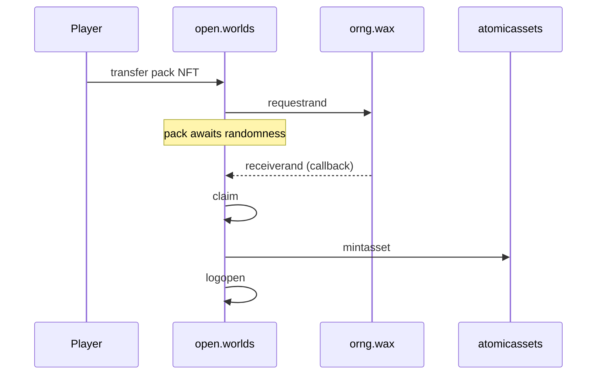
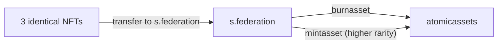

# NFTs and items

import {BlockExplorerContractLinks, BlockExplorerActionLinks, BlockExplorerTableLinks} from '@site/src/components/BlockExplorerLinks';

Tools, land, avatars and weapons are all NFTs in one collection on the third-party
<BlockExplorerContractLinks contract="atomicassets"/> contract. Alien Worlds contracts mint into
it and read attributes out of it; they do not implement NFTs themselves.

## Collection and schemas

`alien.worlds` is both the TLM token account **and** the NFT collection name. Within the
collection, item types are separated by *schema*:

| Schema | Holds |
| --- | --- |
| `tool.worlds` | Mining tools |
| `land.worlds` | Land parcels |
| `faces.worlds` | Avatars |
| `arms.worlds` | Weapons |

:::caution These are schemas, not contracts
`tool.worlds`, `land.worlds`, `faces.worlds` and `arms.worlds` are atomicassets schema names.
They are not accounts and have no actions or tables of their own. Material that presents them as
contracts is wrong — a mistake this documentation itself used to make.
:::

## Which contracts mint

Six contracts send `atomicassets::mintasset`, each for its own reason:

## Packs

<BlockExplorerContractLinks contract="open.worlds"/> opens packs. A pack open cannot be resolved
in the same transaction, because it needs randomness that the sender must not be able to predict:

The WAX RNG oracle (`orng.wax`) supplies the random value in a later transaction. This two-phase
shape is why opening a pack is not instant, and why the contract keeps per-pack state between
the two halves.

## Shining

<BlockExplorerContractLinks contract="s.federation"/> upgrades NFTs by combining lower-rarity
items into a higher-rarity one. It both burns and mints:

Because shining destroys inputs, it is one of the few operations that permanently reduces NFT
supply — relevant if you are reasoning about item scarcity.

## Mint control

<BlockExplorerContractLinks contract="nftmt.worlds"/> is the controlled-minting contract: it
holds mint configurations, sets attributes on minted assets, and is also the one contract that
talks to `atomicmarket`, announcing auctions for assets it mints.

## Redeeming points for NFTs

<BlockExplorerContractLinks contract="uspts.worlds"/> holds the points earned from mining and
mints NFTs when they are redeemed. Because points come only from mining, this closes the loop:
mine with better tools, earn more points, redeem for better tools.
