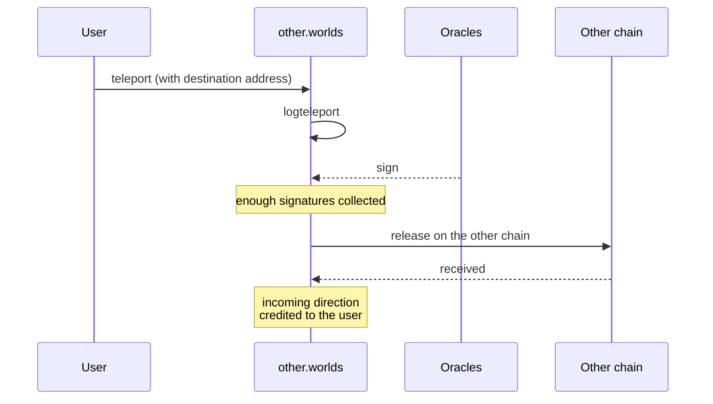

# Cross-chain, competitions and lore

import {BlockExplorerContractLinks, BlockExplorerActionLinks, BlockExplorerTableLinks} from '@site/src/components/BlockExplorerLinks';

TLM exists on more than one chain. This page also covers the two community-facing contracts that sit outside the core mining and governance loops.

## Teleporting TLM between chains

<BlockExplorerContractLinks contract="other.worlds"/> is the teleport contract on WAX. It works
through **oracles**: registered accounts that witness a transfer on one chain and sign for it on
the other.

Oracles are managed with `regoracle` and `unregoracle`, and the contract keeps receipts so that
both directions can be reconciled and repaired if a transfer stalls.

:::note Trust model
Teleport is only as trustworthy as its oracle set. Unlike mining or staking, which are settled
entirely by contract logic, a cross-chain transfer depends on off-chain witnesses signing. That
is a materially different security assumption and worth stating plainly to anyone building on it.
:::

## Competitions

<BlockExplorerContractLinks contract="comp.worlds"/> runs competitions. It accepts TLM by
transfer notification and awards
<BlockExplorerActionLinks contract="uspts.worlds" action="addpoints"/> to winners, so competition
prizes land in the same points balance that mining feeds.

## Tokelore

<BlockExplorerContractLinks contract="lore.worlds"/> is the community lore and voting contract.
It takes TLM deposits by transfer notification, mints NFTs, and publishes results via its own
`publresult` action. The design notes for its proposal lifecycle, voter rewards and voting
incentives live in the contract repository's `docs/` directory.
