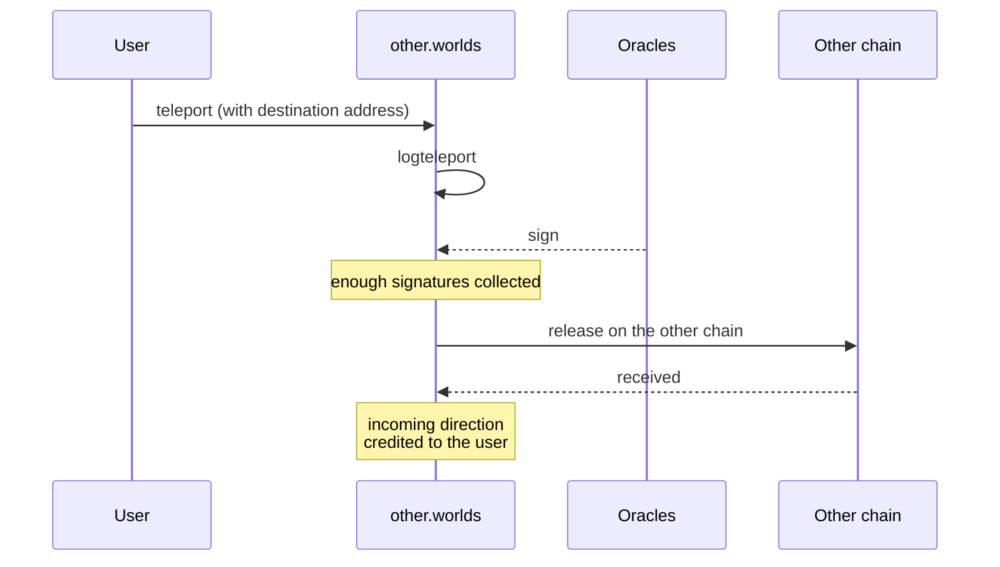

# Cross-chain and payouts

import {BlockExplorerContractLinks, BlockExplorerActionLinks, BlockExplorerTableLinks} from '@site/src/components/BlockExplorerLinks';

TLM exists on more than one chain, and some payouts run on a schedule rather than on demand.

## Teleporting TLM between chains

<BlockExplorerContractLinks contract="other.worlds"/> is the teleport contract on WAX. It works
through **oracles**: registered accounts that witness a transfer on one chain and sign for it on
the other.

Oracles are managed with `regoracle` and `unregoracle`, and the contract keeps receipts so that
both directions can be reconciled and repaired if a transfer stalls.

:::note Trust model
Teleport is only as trustworthy as its oracle set. Unlike mining or staking, which are settled
entirely by contract logic, a cross-chain transfer depends on off-chain witnesses signing. That
is a materially different security assumption and worth stating plainly to anyone building on it.
:::

### The automation helper

<BlockExplorerContractLinks contract="bina.world"/> is a small automation contract that holds a
config and can be started and stopped. It calls `alien.worlds::transfer` and
`other.worlds::teleport`, so it exists to drive teleports automatically rather than to implement
teleporting itself. Its whole surface is `setconfig`, `start`, `stop` and `trigger`.

## Scheduled payouts

<BlockExplorerContractLinks contract="arena.worlds"/> pays out on a schedule instead of on
demand. A schedule is registered, then claimed against over time:

| Action | Purpose |
| --- | --- |
| <BlockExplorerActionLinks contract="arena.worlds" action="addschedule"/> | Register a payment schedule |
| <BlockExplorerActionLinks contract="arena.worlds" action="updschedule"/> | Change an existing schedule |
| <BlockExplorerActionLinks contract="arena.worlds" action="claim"/> | Draw the amount currently due |
| <BlockExplorerActionLinks contract="arena.worlds" action="setactive"/> | Enable or disable a schedule |
| <BlockExplorerActionLinks contract="arena.worlds" action="remove"/> | Delete a schedule |

The transfer target is resolved from the schedule record at run time rather than being a fixed
account, so one deployment can pay in different tokens.

:::info Source is ahead of the chain here
The source declares a `setpayremain` action that is **not present in the deployed contract**. If
you are working from the repository rather than the ABI, do not assume it is callable.
:::

## Competitions

<BlockExplorerContractLinks contract="comp.worlds"/> runs competitions. It accepts TLM by
transfer notification and awards
<BlockExplorerActionLinks contract="uspts.worlds" action="addpoints"/> to winners, so competition
prizes land in the same points balance that mining feeds.

## Tokelore

<BlockExplorerContractLinks contract="lore.worlds"/> is the community lore and voting contract.
It takes TLM deposits by transfer notification, mints NFTs, and publishes results via its own
`publresult` action. The design notes for its proposal lifecycle, voter rewards and voting
incentives live in the contract repository's `docs/` directory.
